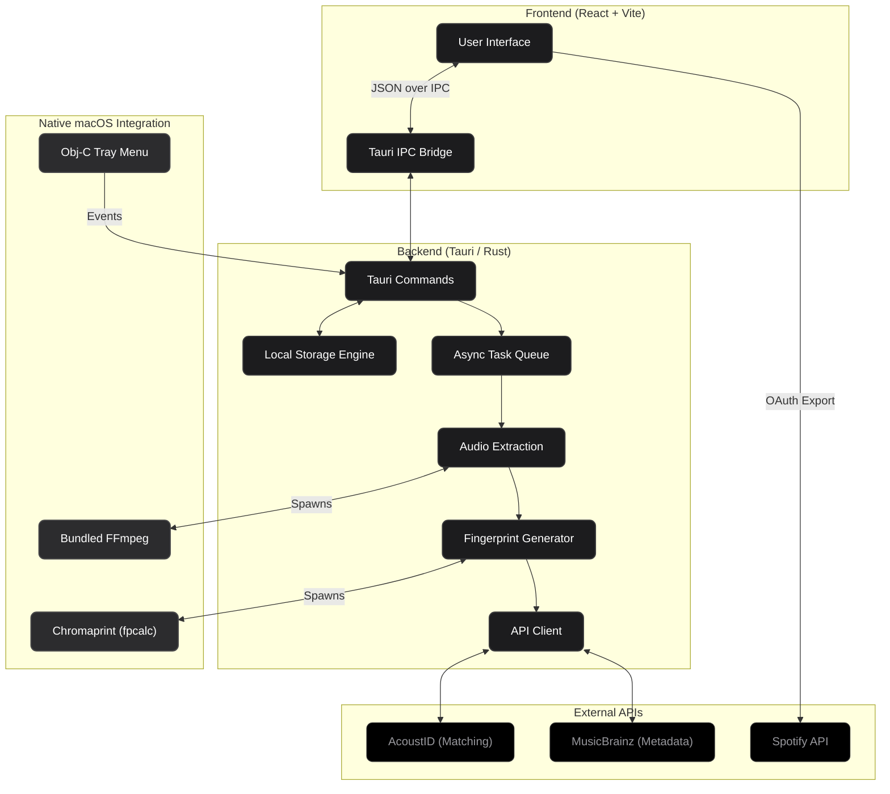

<div align="center">
  <picture>
    <source media="(prefers-color-scheme: dark)" srcset="./assets/docs/banner-dark.png">
    <source media="(prefers-color-scheme: light)" srcset="./assets/docs/banner-light.png">
    
  </picture>
</div>

<p align="center">
  <a href="https://github.com/DawnSaju/SonIQ/releases/latest">
    
  </a>
</p>

<p align="center">
  <a href="https://github.com/DawnSaju/SonIQ/releases"></a>
  <a href="https://www.linkedin.com/in/DawnSaju/"></a>
  <a href="https://x.com/dawn_saju"></a>
</p>

---

### Problem
I'm a computer science student, and I edit videos in my free time. My personal drive is filled with reference clips, videos and other files.

Often, I wonder what songs are being used in videos and want to find them later. But holding my phone to the speakers and trying to Shazam a song before the voiceover comes on is quite time consuming. Plus, I don't like uploading my project files to some random website just to identify a song.

---

### Solution
So I built **SonIQ** (*pronounced sonic*). It's a local macOS app that runs entirely on your device. You drop a video in, it extracts the audio, generates a fingerprint, and matches it. The files never leave your Mac, and you can export the found tracks straight to your Spotify or YouTube playlists.

---

### How I Came Up With the Name
Here's the thought process behind the branding and logo:

<div align="center">
  
</div>

---

### Stack

- Tauri 2 + Rust + Objective-C
- React + Vite + TypeScript + Vanilla CSS + Framer Motion
- FFmpeg + Chromaprint
- AcoustID + MusicBrainz
- Spotify API

---

### Building SonIQ
SonIQ was built for the OpenAI Build Challenge using Codex and GPT-5.6 models.

I ain't gonna lie, this was my first ever experience with Rust. It was a lot easier since I have a technical background in development and knew exactly what I wanted to build. So I had GPT-5.6 Terra write the audio extraction pipeline. Figuring out the exact FFmpeg flags for downmixing audio usually takes a lot of trial and error with the docs, but the output I got was beyond my expectations.

I used GPT-5.6 Terra for the hard parts of Tauri. Audio fingerprinting is heavy, and my first try completely froze the UI. GPT-5.6 Terra walked me through fixing it by moving the extraction to a background thread in Rust so the app stayed responsive. It also helped me out when I was building the macOS `.dmg`. Packaging external binaries in Tauri is confusing, but GPT-5.6 Terra gave me the exact config I needed so the app wouldn't instantly crash when someone else tried to run it.

---

### Models Used In The Project

I also used the Gemini 3.1 Pro model as well, due to running out of credits for the GPT-5.6 model. It's a great model, but it couldn't keep up with the performance and quality output compared to the GPT-5.6 models.

- **GPT-5.6 Luna (Extra High)**
- **GPT-5.6 Terra (Extra High, Ultra)**
- **Gemini 3.1 Pro**

---

### Architecture

I set up SonIQ so all the heavy audio processing happens right on your Mac. The only time it touches the internet is to grab the actual track metadata.


---

### Running the Project Locally

If you want to run the open source version of SonIQ on your Mac, you require Node.js and Rust installed, along with FFmpeg.

**Prerequisites:**
- macOS
- Node.js
- Rust (latest stable)
- FFmpeg (`brew install ffmpeg`)

**Setup Instructions:**
1. Clone the repository.
2. Run `npm install` to install the necessary packages.
3. Run `npm run tauri dev` to start the dev server.

---

### ⚠️ macOS .dmg Installation (Important)
Because this app was built for this hackathon and is not signed as an Apple Developer, macOS Gatekeeper may flag it as "damaged" when you try to open it. 

To fix this, open your Terminal and run:
```bash
xattr -cr /Applications/SonIQ.app
```
*(Make sure you have manually dragged SonIQ into your Applications folder first!)*

---

### My Takeaways

Overall, it was a give and take process. I gotta say the GPT-5.6 models are powerful and hold a lot of potential. It's all in how you use it and the output you receive is pretty crazy. It was a great experience building SonIQ, and I hope you enjoy using it. 

With this challenge, I've learned a lot about building desktop applications and project orchestration and documentation.

---

### Developer

<a href="https://github.com/DawnSaju">
  
</a>

Built by [DawnSaju](https://github.com/DawnSaju) for OpenAI Build Week 2026 with Codex.

---

### License

This project is licensed under the GPL-2.0 license - see the [LICENSE](LICENSE) file for details.
